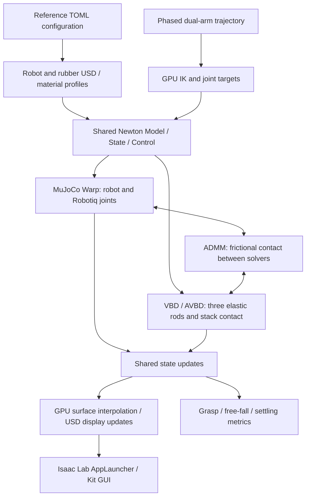

# Newton VBD WeatherStrip

[English](README.md) | [한국어](README_KR.md)

**Dual-arm robotic picking, stretching, and free fall of an automotive door weatherstrip with Newton VBD and MuJoCo Warp**

Two FANUC CRX-10iA/L robots with Robotiq 2F-85 grippers pick the top of three weatherstrips stacked on a table. They lift and stretch it, bring their hands closer to let it sag, then open the grippers in midair so it falls onto the lower two seals. Robot joints, elastic deformation, frictional contact, and gravity-driven motion are simulated and displayed in the Isaac Lab GUI.


*Actual Isaac Lab viewport recording with Newton 1.6.0 / Warp 1.17.0. The loop shows picking → lifting → stretching → relaxation → release and free fall → stack settling. Capturing every fourth 60 Hz physics frame and playing at 15 FPS reproduces simulation time at 1× speed; it does not indicate GUI throughput.*

| Component | Implementation |
| --- | --- |
| Robots / end effectors | FANUC CRX-10iA/L × 2 / Robotiq 2F-85 × 2 |
| Elastic objects | Three closed elliptical door seals, 64 rod segments each |
| Rubber dynamics | Rigid rod/cable and AVBD path in Newton `SolverVBD` |
| Robot dynamics | Newton `SolverMuJoCo` → MuJoCo Warp GPU backend |
| Solver interaction | Frictional contact coupling through `SolverCoupledADMM` |
| Visualization | Isaac Lab `AppLauncher` + Kit viewport + USD updates |
| Validation | Full GPU cycle, extended settling, repeated GUI cycles, USD checks, and CPU regressions |

> **Scope:** An installable, runnable, and testable SimReady reference example. It is not a digital twin calibrated to measured EPDM properties or an officially certified SimReady asset. It is also not an Isaac Lab `DirectRLEnv` training environment or a standard `NewtonManager` integration.

## Contents

- [1. Scenario and scope](#1-scenario-and-scope)
- [2. System architecture](#2-system-architecture)
- [3. Physics model and solver theory](#3-physics-model-and-solver-theory)
- [4. SimReady asset creation](#4-simready-asset-creation)
- [5. Development sequence and design decisions](#5-development-sequence-and-design-decisions)
- [6. Installation](#6-installation)
- [7. Running the demo](#7-running-the-demo)
- [8. Configuration and tuning](#8-configuration-and-tuning)
- [9. Validation and performance](#9-validation-and-performance)
- [10. Repository layout](#10-repository-layout)
- [11. Troubleshooting](#11-troubleshooting)
- [12. Extensions and model limitations](#12-extensions-and-model-limitations)
- [13. References and licensing](#13-references-and-licensing)

## 1. Scenario and scope

The default cycle lasts **13.05 seconds of simulation time**. `Play` runs one cycle and pauses at completion for inspection. `Reset` reconstructs both the state and the solvers' internal contact and iteration history.

| Phase | Duration | Behavior |
| --- | ---: | --- |
| Prepare / approach | 0.80 / 0.70 s | Gravity and contact settle the three seals; both arms approach the top seal |
| Grasp | 1.00 s | Close the Robotiq main joints to establish frictional contact at both ends |
| Lift | 2.00 s | Move upward while preserving the grasped XY positions |
| Stretch / hold | 1.20 / 0.50 s | Move each hand outward by 80 mm and hold the stretched shape |
| Relax / sag | 1.00 / 0.80 s | Bring the hands closer and lower them by 25 mm to let the seal sag |
| Open / wait for fall | 0.45 / 1.00 s | Open the grippers in midair and allow gravity-driven free fall |
| Retreat / settle | 0.60 / 3.00 s | Move the grippers away and let the seal settle onto the lower two |

- All three seals are dynamic. The lower two also respond to collisions and loads.
- No temporary fixed joints, attachments, or coordinate overrides connect the rubber to the grippers.
- Grasp locations are estimated from segment positions provided by the simulator. Camera perception and real sensor feedback are not included.
- The trajectory is a deterministic phase plan, while deformation, slipping, and falling result from contact dynamics. Hardware and computation order can produce small numerical differences.


*Release and settling from the same GUI cycle. The shape is not created by freezing the rubber or putting it to sleep.*

## 2. System architecture



### Division of responsibilities

`simulation.py` assembles the robots and rubber into one Newton model and explicitly assigns body and joint ownership to each solver.

- **MuJoCo Warp:** 32 bodies, 24 joint coordinates, and 10 mimic constraints across both arms and grippers.
- **VBD:** 192 rod bodies and 192 closed-loop cable joints across the three seals.
- **ADMM:** The contact interface between objects owned by different solvers.
- **Static environment:** The table and floor are fixed collision shapes.

Render surfaces are updated only after computing the physical state. Visualization does not determine the rubber's physical positions. Kit's standard timeline handles user input and time display; PhysX does not simultaneously integrate this scene.

The default is eight physics substeps per display frame.

$$
\Delta t_{\mathrm{frame}}=\frac{1}{60}\;\mathrm{s},\qquad
h=\frac{1}{60\times8}\approx2.083\;\mathrm{ms}
$$

Each substep performs collision detection → ADMM coupling → joint-state updates. The defaults are eight VBD iterations, four ADMM iterations, and eight MuJoCo CG iterations. These belong to different iteration loops and should not be interpreted as one combined iteration count.

## 3. Physics model and solver theory

### 3.1 Door weatherstrip approximated by a closed rod

The initial centerline is the following ellipse.

$$
\mathbf p_i=
\begin{bmatrix}
a\cos\theta_i & b\sin\theta_i & z_0
\end{bmatrix}^{\mathsf T},\qquad
\theta_i=\frac{2\pi i}{N}
$$

The defaults are $a=0.28$ m, $b=0.22$ m, and $N=64$, with a 20 mm outer diameter and a mass of 0.40 kg per seal. `ModelBuilder.add_rod(..., closed=True)` creates rigid capsules and cable joints for the segments and connects the last segment to the first. Each capsule is rigid, but stretch, shear, bending, and twist at the connections make the complete seal behave elastically.

This reduces a real seal with a hollow bulb and lips to a **one-dimensional elastic rod with a circular cross section**. Despite its thick appearance, the model does not perform volumetric FEM or cross-sectional compression analysis.

| Mode | Physical meaning | Default stiffness | Default damping |
| --- | --- | ---: | ---: |
| Stretch | Axial length change between segments | 5,000 N/m | 0.10 N·s/m |
| Shear | Relative displacement perpendicular to the centerline | 5,000 N/m | 0.10 N·s/m |
| Bending | Change in orientation between adjacent segments | 1.20 N·m/rad | 0.024 N·m·s/rad |
| Twist | Relative rotation around the rod axis | 0.40 N·m/rad | 0.008 N·m·s/rad |

The following equivalent relations describe small displacements and rotations. The actual solver uses both three-dimensional segment positions and rotations.

$$
f_s\approx k_s\Delta\ell+c_s\Delta\dot\ell,\qquad
\tau_b\approx k_b\Delta\theta+c_b\Delta\dot\theta
$$

When authoring USD material properties, the average segment length $\bar\ell$ and circular cross-section geometry are used to obtain equivalent coefficients.

$$
A=\pi r^2,\qquad I=\frac{\pi r^4}{4},\qquad J=\frac{\pi r^4}{2}
$$

$$
E_s\approx\frac{k_s\bar\ell}{A},\quad
G_s\approx\frac{k_{\mathrm{shear}}\bar\ell}{A},\quad
E_b\approx\frac{k_b\bar\ell}{I},\quad
G_t\approx\frac{k_t\bar\ell}{J}
$$

Here $E_s,E_b,G_s,G_t$ are independently tuned **equivalent coefficients**, not an identified Young's modulus and Poisson's ratio for homogeneous isotropic rubber. The runtime uses the segment stiffnesses stored in TOML/JSON. If the segment count or cross section changes, revisit length and cross-section scaling and revalidate the behavior instead of copying the old stiffnesses unchanged.

Mass is matched using the sum of cylindrical segment volumes. The hemispherical ends of collision capsules do not add overlapping mass. The resulting equivalent density should therefore not be interpreted as measured EPDM density.

### 3.2 VBD and AVBD

VBD (Vertex Block Descent) solves the variational problem of implicit time integration through iterative optimization of small blocks. A representative formulation for particle positions $\mathbf x$ is:

$$
\mathbf x^{n+1}=\arg\min_{\mathbf x}
\left[
\frac{1}{2h^2}(\mathbf x-\mathbf y)^{\mathsf T}M(\mathbf x-\mathbf y)
+E(\mathbf x)
\right]
$$

$\mathbf y$ is the inertial prediction and $E$ contains elastic, contact, and other energies. Instead of solving all degrees of freedom at once, each block reduces energy using its gradient and local Hessian while the other blocks stay fixed. Graph coloring groups blocks that are not directly connected so that blocks of the same color can be processed in parallel on the GPU. [Original VBD paper](https://graphics.cs.utah.edu/research/projects/vbd/)

The rubber in this project consists of rigid rods rather than a volumetric particle mesh, so it uses the **rigid AVBD (Augmented VBD) path** inside Newton `SolverVBD`. Rod blocks include rotation as well as translation. AVBD uses augmented Lagrangian state to handle stiff contact and joint constraints. Conceptually, a constraint $C$ adds the following terms:

$$
\mathcal L_{\mathrm{aug}}=E+\lambda^{\mathsf T}C+\frac{\rho_c}{2}\lVert C\rVert^2
$$

In the default implementation, cable stretch, shear, bending, and twist use soft modes with finite stiffness, while rigid contact uses hard mode. `builder.color()` is required, and damping coefficients `kd` are interpreted in absolute physical units. [Newton SolverVBD API](https://newton-physics.github.io/newton/1.6.0/api/_generated/newton.solvers.SolverVBD.html), [original AVBD paper](https://graphics.cs.utah.edu/research/projects/avbd/)

The stability discussion in the VBD paper does not imply unconditional success for this entire scene. The scene includes finite iterations, collision detection, joint drives, and coupling between different solvers. Too few iterations or excessive contact stiffness can produce slipping, residual oscillation, and constraint errors.

### 3.3 Robot and gripper dynamics with MuJoCo Warp

MJWarp runs MuJoCo dynamics on NVIDIA GPUs. Newton's `SolverMuJoCo` handles model and state conversion here. The articulated system can be expressed conceptually as:

$$
M(q)\ddot q+h(q,\dot q)=\tau_{\mathrm{drive}}+J(q)^{\mathsf T}\lambda+\tau_{\mathrm{ext}}
$$

Inverse kinematics generates joint targets for the desired hand positions and orientations; the physical joints follow those targets through drives and constraints. IK does not directly move the rubber.

| Setting | Value / role |
| --- | --- |
| Backend | MuJoCo Warp, default `use_mujoco_cpu=False` path |
| Joint constraint solver / integrator | `cg` / `implicitfast` |
| MuJoCo iterations / line search | 8 / 4 |
| Native contact detection | `use_mujoco_contacts=False` |
| Robotiq open / closed targets | 0 / 0.78 rad |
| Main-joint drive stiffness / damping | 180 N·m/rad / 8 N·m·s/rad |
| Main-joint torque limit | 26 N·m |
| Mimic constraints | Five per gripper, ten total |

Driving one Robotiq main joint moves the other finger joints through mimic equalities. The example sets `eq_solref=[0.004,1.0]` and `eq_solimp=[0.99,0.99,0.001,0.5,2.0]` to prevent excessive opening of passive joints under contact loads. These are solver tuning values for the example, not a reproduction of the manufacturer's controller specifications.

`use_mujoco_contacts=False` does not disable all contact. It selects the contact path managed by Newton and the coupled solver. In particular, rubber–gripper contact across solvers is handled by the following ADMM interface. [Newton MuJoCo documentation](https://newton-physics.github.io/newton/1.6.0/solvers/mujoco.html), [MuJoCo Warp](https://github.com/google-deepmind/mujoco_warp)

### 3.4 Coupling two solvers with ADMM

ADMM (Alternating Direction Method of Multipliers) splits a coupled problem into subproblems and alternately updates each part and its interface variables. A generic two-block problem is:

$$
\min_{x,z}\; f(x)+g(z)\quad\text{subject to}\quad Ax+Bz=c
$$

$$
\begin{aligned}
x^{k+1}&=\arg\min_x f(x)+\frac{\rho}{2}\lVert Ax+Bz^k-c+u^k\rVert^2\\
z^{k+1}&=\arg\min_z g(z)+\frac{\rho}{2}\lVert Ax^{k+1}+Bz-c+u^k\rVert^2\\
u^{k+1}&=u^k+Ax^{k+1}+Bz^{k+1}-c
\end{aligned}
$$

These equations explain the splitting principle. Newton's rigid-contact implementation does not apply them directly to position vectors in this form. It uses `ModelView`, per-solver states, force injection, effective mass and proximal terms, contact rows, and dual variables. [ADMM reference](https://stanford.edu/~boyd/papers/admm_distr_stats.html)

The configuration used here is:

```python
SolverCoupledADMM.Config(
    iterations=4,
    rho=200.0,
    gamma=0.001,
    baumgarte=0.5,
    rigid_contact_matching="latest",
    contact_matching_force_scale=0.9,
    contact_pairs=[
        SolverCoupledADMM.ContactPair(source="mjc", destination="vbd"),
    ],
)
```

ADMM constructs contact rows between objects with different ownership through its internal detection path and uses a maximum-dissipation Coulomb projection for frictional contact. This cross-solver contact is distinct from rubber–rubber contact solved by VBD. `rho` is a numerical interface penalty, not the rubber's Young's modulus or a contact spring stiffness in N/m. A fixed iteration budget is used; full convergence at every substep is not claimed. [Newton coupled solver documentation](https://newton-physics.github.io/newton/1.6.0/concepts/coupling.html)

### 3.5 Stack settling and contact coefficients

The initial stacking pitch is 25 mm. The lower two seals are rotated by +30° and −30° to form support points between their circular sections; the top seal is placed at 0°. Only redundant self-collisions between neighboring segments of the same seal are excluded. Distant segments and different seals still collide.

The final configuration **reduces VBD rubber–rubber and rubber–table contact stiffness from 50,000 to 5,000 N/m** to reduce numerical contact jitter. Bending stiffness remains 1.20 N·m/rad so the overall ellipse does not become excessively floppy. Centerline shape recovery and contact response are tuned separately.

- VBD contact damping: 10 N·s/m.
- Rubber shape friction: 2.0; table shape friction: 0.15.
- VBD mixes stiffness and damping arithmetically and friction geometrically. The mixed rubber–table VBD friction is therefore $\sqrt{2.0\times0.15}\approx0.548$.
- Collision margin is 1 mm and gap is 2 mm. The rendered surface and contact boundary do not coincide exactly.
- `gripper_contact_*` values are **nominal contact-pair coefficients** authored on shape materials. They should not be read as effective ADMM cross-contact stiffness. Grasping also depends on ADMM settings, drives, mimic constraints, friction, and grasp position.

Residual oscillation is not suppressed by forcibly zeroing rubber velocities or making bodies static. No temporal jitter filter is applied to the render surfaces either.

### 3.6 Separate physical and visual resolution

Physics uses 64 rod segments per seal. Visualization constructs a periodic Catmull–Rom curve through the actual segment centers, then builds a surface with 256 cross sections and 16 points around each section: 4,096 vertices per seal.

Interpolation, cross-section frames, and normals are computed on the GPU. Results for all three seals are transferred to the CPU together for USD updates. Parallel transport propagates the section frames to reduce abrupt normal flips. This reduces the chain-like appearance near the grippers without increasing the physical rod count. The display surface is not the collision mesh.

## 4. SimReady asset creation

In this example, a SimReady asset is a package containing **geometry, units, material properties, collision definitions, coordinate conventions, provenance, a runtime contract, and validation results**, rather than just a visually appealing USD file.

| Step | Task | Output / acceptance criteria in this repository |
| --- | --- | --- |
| 1 | Define the required behavior and allowed approximations | Three-seal stack, top-only grasp, elastic stretch, midair release, natural fall |
| 2 | Pin source assets and versions | `assets/manifest.json`: official URLs, commits, per-file SHA-256 |
| 3 | Normalize coordinates and units | SI units, Z-up, valid default prim, aligned robot flange and grasp frames |
| 4 | Author the physical centerline and topology | Elliptical periodic curve, duplicate endpoint handling, 64 closed-loop joints |
| 5 | Author cross section, mass, and material | Radius, total mass, stretch/shear/bend/twist stiffness and damping |
| 6 | Define collision policy | Capsule radius, margin/gap, same-seal neighbor exclusions, inter-seal collisions |
| 7 | Build visual assets | Black rubber material, continuous surfaces and normals, grasp-site metadata |
| 8 | Validate standalone import | Mass, loop closure, coordinates, valid normals, missing USD dependencies |
| 9 | Validate interaction | Contact-based grasp, lower seals staying down, free fall, landing, and settling |
| 10 | Package for distribution | Reproducible installation and downloads, pinned versions, automated checks, run documentation |

### Asset package

```text
assets/weatherstrip/
├── weatherstrip.usda    # Reusable single weatherstrip
└── runtime.json         # Exact segment stiffness, damping, mass, and runtime assumptions
```

The main USD prims are:

```text
/Weatherstrip
├── Physics/Centerline
├── Physics/NeighborExclusions
├── Visual/Surface
├── Looks/RubberPhysics
├── Looks/RubberSurface
└── GraspSites/{Left,Right}
```

`PhysicsCurvesDeformableSimAPI` and the associated curve material properties are proposal schemas understood by the pinned Newton version. They do not imply that every USD consumer will run the same rubber physics automatically. Standalone import validation for one asset is distinct from runtime validation of three seals assembled using the segment coefficients in `runtime.json`.

`load_weatherstrip_points()` reads the centerline from USD and checks that the current configuration matches the material profile in `runtime.json`. Execution stops if material settings change without rebuilding the asset. This contract prevents stale USD assets from being mixed with new physics settings.

## 5. Development sequence and design decisions

When developing a new deformable manipulation example, separate the problems in the following order.

1. **Validate the standalone asset:** Check coordinates, mass, loop closure, self-collision exclusions, and falling before adding robots.
2. **Validate robot and end-effector assembly:** Check flange orientation and length, end-effector origin, joint and mimic counts, and opening/closing limits. This example mounts at J6 with a +X translation of 160 mm and a 90° rotation around Y.
3. **Validate contact-based grasping:** Confirm contact at both fingers without an attachment. Grasp depth is 17 mm, selected after inspecting the closed pad region of the actual mesh. Catching a pad edge can slip under small numerical changes.
4. **Validate single-seal stretching:** Lift vertically from the grasp location before stretching outward. Unnecessary XY motion during lift can break the grasp.
5. **Extend to a stack:** Verify top-only grasping while preserving motion and contact of the lower two seals. Check lower-seal centroid lift, not just the highest point reached.
6. **Validate release and free fall:** Confirm an airborne interval with no gripper, table, or lower-seal contact, then track subsequent landing contact with the lower seals.
7. **Tune settling:** Distinguish restoring stiffness, material damping, contact stiffness, time step, and iteration count. Excessive damping alone can alter grasping and recovery.
8. **Improve visual quality:** Interpolate surfaces separately from physics and test closure, radius, and normals.
9. **Improve performance:** Measure CUDA execution, CPU transfers, USD writes, and Kit display costs separately. Revalidate the full cycle after reducing buffers or iterations.
10. **Validate distribution:** Check a clean Python environment, fresh official asset downloads, execution from outside the repository, the actual GUI, and recorded USD.

Validation currently targets exactly three stacked seals. Simply increasing `stack_count` is not a supported interface for generalizing to an arbitrary number of seals.

## 6. Installation

### 6.1 Validated environment and requirements

| Component | Validated configuration |
| --- | --- |
| OS | Ubuntu 24.04.4 LTS, Linux x86-64 |
| Python | 3.12 |
| GPU / driver | NVIDIA RTX 6000 Ada 48 GB / 595.91.07 |
| Newton | 1.6.0, upstream tag `v1.6.0` |
| Warp | 1.17.0 |
| MuJoCo / MuJoCo Warp | 3.12.0 each |
| NumPy / OpenUSD | 2.3.1 / `usd-core` 25.11 |
| Isaac Sim | 6.0.1.0 |
| Isaac Lab source | Commit `2e44ddb2e19536579140496023b5ccb060bc4152` |
| Python metadata version of that Isaac Lab source | 6.1.17 |
| PyTorch in the GUI environment | 2.11.0+cu128 |

An NVIDIA CUDA GPU and compatible driver are required. The Isaac Lab GUI additionally needs Vulkan/RTX graphics support and a working desktop session. The table describes the tested environment, not minimum requirements, and does not guarantee identical FPS on other GPUs. Windows and ARM have not been validated in this repository.

**Install compute-only and GUI dependencies in separate environments.** Physics validation without visualization does not require Isaac Sim, Isaac Lab, or PyTorch.

### 6.2 Compute-only installation — validated in a fresh environment

```bash
git clone git@github.com:nv-jonghwan/NewtonVBD_WeatherStrip.git
cd NewtonVBD_WeatherStrip

python3.12 -m venv .venv
source .venv/bin/activate
python -m pip install --upgrade pip
python -m pip install -c requirements/compute-constraints.txt -e .

# Download 15 official asset files and verify SHA-256
python scripts/fetch_assets.py

# Build the weatherstrip and validate USD physics import
./scripts/python.sh scripts/build_asset.py
./scripts/python.sh scripts/validate_asset.py
./scripts/python.sh -m newton_weatherstrip.doctor --runtime --import-smoke

# Run the full GPU scenario and save JSON and USD
./scripts/run_headless.sh
```

If GitHub SSH keys are unavailable, use `https://github.com/nv-jonghwan/NewtonVBD_WeatherStrip.git` as the clone URL.

`fetch_assets.py` downloads only the pinned FANUC and Robotiq files. If an existing file has the wrong checksum, it reports an error instead of overwriting it. To verify existing files without network access:

```bash
python scripts/fetch_assets.py --offline
```

### 6.3 Isaac Lab GUI environment

**If you already have a working Isaac Sim 6.0.1 environment, use its Python interpreter.** The following commands describe creating a new GUI environment. Isaac Sim downloads are much larger than the compute-only dependencies and require access to NVIDIA's distribution servers.

```bash
python3.12 -m venv .venv-gui
source .venv-gui/bin/activate
python -m pip install --upgrade pip

python -m pip install "isaacsim[all,extscache]==6.0.1.0" \
  --extra-index-url https://pypi.nvidia.com
python -m pip install "torch==2.11.0" \
  --index-url https://download.pytorch.org/whl/cu128
python -m pip install toml==0.10.2 packaging==26.0
python -m pip install -e .

# Pinned source checkout for AppLauncher and Kit app settings
git clone https://github.com/isaac-sim/IsaacLab.git .cache/IsaacLab
git -C .cache/IsaacLab checkout 2e44ddb2e19536579140496023b5ccb060bc4152

export WEATHERSTRIP_PYTHON="$PWD/.venv-gui/bin/python"
export WEATHERSTRIP_ISAACLAB="$PWD/.cache/IsaacLab"
./scripts/run_isaaclab.sh
```

This example only uses `AppLauncher`; the complete training dependency set is not required. The wrapper adds `WEATHERSTRIP_ISAACLAB/source/*` to Python's search path. The full `setup.py` at the pinned Isaac Lab commit depends on Warp 1.13.0, which conflicts with this example's Newton 1.6 / Warp 1.17 combination if installed indiscriminately. Integration into an Isaac Lab training environment requires separate compatibility checks.

GUI validation uses an existing Isaac Sim installation and **unmodified, pinned Isaac Lab source**. The repository does not provide a universal installer or Docker image that installs every GUI package on every system. Follow Isaac Sim's instructions for NVIDIA EULA acceptance and first-run shader preparation. [Isaac Lab installation guide](https://isaac-sim.github.io/IsaacLab/v3.0.0-beta2/source/setup/installation/pip_installation.html)

### 6.4 Selecting Python and GPUs

`./scripts/python.sh` selects Python in this order:

1. The executable explicitly specified by `WEATHERSTRIP_PYTHON`.
2. The repository's `.venv/bin/python`.
3. An optionally bound `.workspace/toolchain/bin/activate` environment.
4. `python3` from the current `PATH`.

If both `.venv` and `.venv-gui` exist, set `WEATHERSTRIP_PYTHON` explicitly when launching the GUI. Workstation-specific `.workspace/` bindings are ignored by Git and are not required for general use.

```bash
# Compute only: expose physical GPU 1 as cuda:0 inside the process
WEATHERSTRIP_GPU=1 ./scripts/run_headless.sh

# GUI: render on GPU 0 and simulate on GPU 1
WEATHERSTRIP_PYTHON="$PWD/.venv-gui/bin/python" \
WEATHERSTRIP_ISAACLAB="$PWD/.cache/IsaacLab" \
WEATHERSTRIP_DEVICE=cuda:1 WEATHERSTRIP_RENDER_GPU=0 \
./scripts/run_isaaclab.sh
```

By default, the GUI uses GPU 0 for both physics and rendering. Its wrapper unsets `CUDA_VISIBLE_DEVICES` to keep the display GPU visible. The compute-only wrapper respects the caller's device visibility settings.

## 7. Running the demo

### GUI

```bash
./scripts/run_isaaclab.sh

# Autoplay and pause near 5.8 seconds to inspect the stretched seal
./scripts/run_isaaclab.sh --auto-play --pause-at 5.8
```

The `Newton VBD | WeatherStrip` panel provides:

- **Play / Pause / Reset:** Start a full cycle, pause, or reconstruct the initial state.
- **Scene view / Seal close-up:** View the full robot scene or the seal in detail.
- **Save screenshot:** Save the viewport to `results/weatherstrip_<date>_<time>.png`.
- Status: phase, simulation time, seal span, FPS, and physics/USD update costs.

The 60 Hz setting defines simulation time steps. For example, at 20 GUI FPS, advancing one simulated second takes about three wall-clock seconds. GUI FPS is distinct from a real-time factor of 1.0.

### Regenerating the README animation

A GUI environment and FFmpeg are required. The frame directory must be empty. Only a complete recording that passes physics validation can be encoded as a GIF. The camera stays fixed during recording.

```bash
./scripts/run_isaaclab.sh --capture-dir results/demo-frames \
  --camera scene --capture-stride 4 --exit-after-cycle
python3 scripts/make_demo_gif.py results/demo-frames results/dual-arm-cycle.gif
```

Inspect the output, then copy it to `docs/media/dual-arm-cycle.gif`. `capture.json` records engine versions, simulation times, phase-by-phase frames, and validation results. The GIF is 960 px wide, plays at 15 FPS, and loops indefinitely. Source PNG frames are not tracked by Git.

### Recording and validation

```bash
# Default full cycle and recorded USD
./scripts/run_headless.sh

# Validate physics without USD recording overhead
./scripts/run_headless.sh --viewer null \
  --metrics-path results/physics_only.json

# Continue simulation to 20 seconds to check stack stability
./scripts/run_headless.sh --num-frames 1200 \
  --output-path results/long_settle.usd \
  --metrics-path results/long_settle.json

# Validate all three recorded surfaces, normals, and dependencies
./scripts/python.sh scripts/validate_recording.py results/long_settle.usd
```

Default outputs are `results/metrics.json` and `results/weatherstrip_cycle.usd`. Check `validation_passed` in the JSON for the full-cycle result. Short smoke runs only check initialization and finite state; they do not establish that the complete scenario passes.

### Using another configuration

```bash
cp config/default.toml config/my_scene.toml
# Edit config/my_scene.toml
./scripts/python.sh scripts/build_asset.py --config config/my_scene.toml
./scripts/python.sh scripts/validate_asset.py --config config/my_scene.toml
./scripts/run_headless.sh --config config/my_scene.toml
./scripts/run_isaaclab.sh --config config/my_scene.toml
```

All asset builds write to `assets/weatherstrip/`. Use separate checkouts to run different material configurations concurrently. Building an asset with one configuration and running the default configuration intentionally raises a profile mismatch error.

## 8. Configuration and tuning

The reference configuration is [config/default.toml](config/default.toml).

| Goal | Settings / code to inspect first | Also check |
| --- | --- | --- |
| Increase stretch compliance | `stretch_stiffness_n_m`, `shear_stiffness_n_m` | Stretched span, grip loss, time step |
| Preserve the elliptical shape | `bend_stiffness_n_m`, `twist_stiffness_n_m` | Recovery speed and sag during lift |
| Reduce persistent oscillation | Material damping, `contact_stiffness_n_m`, `contact_damping_n_s_m` | Final-second RMS speed and grasp/drop regressions |
| Change thickness | `cross_section_radius_m` | Mass/density, neighbor collisions, stacking pitch, pad position, USD rebuild |
| Reduce grip loss | `grip_depth_m`, drive targets, mimic and ADMM settings | Actual pad-center alignment and accidental lower-seal grasp |
| Adjust numerical accuracy | `substeps`, `solver_iterations`, `admm_iterations`, `mujoco_iterations` | Full-cycle pass and buffer overflow |
| Increase contact capacity | `CollisionPipeline(..., rigid_contact_max=8192)` | `peak_rigid_contacts` and overflow logs |
| Improve visual quality | `skin.py`, `presentation.py` | Normals and loop closure independently of physical segment count |

**Change one variable, inspect its effect, then revalidate the full cycle.** Raising contact stiffness is not simply an accuracy improvement: it can worsen conditioning or require smaller substeps and more iterations. Conversely, a successful grasp at a low iteration count does not guarantee the same stability in every environment.

## 9. Validation and performance

### Automated validation

```bash
./scripts/python.sh -m unittest discover -s tests -v
./scripts/python.sh scripts/validate_asset.py
./scripts/python.sh -m newton_weatherstrip.doctor --runtime --import-smoke
./scripts/run_headless.sh
```

GitHub Actions checks surface regressions, asset manifest integrity, and Python/shell syntax on CPU. **The standard GitHub CPU runner does not validate GPU dynamics or the Kit GUI.**

Full-cycle validation includes:

| Check | Default acceptance criterion |
| --- | --- |
| Numerical state | No NaN or Inf in body or joint states |
| Bilateral grasp | Actual collision contact pairs, jaw closing, and reopening observed |
| Whole-seal lift | Lowest segment of the top seal rises at least 120 mm above its initial height |
| Grasp retention | Maximum nearest distance between rubber and grasp reference points at most 80 mm |
| Stretch / recovery | 90–115% of target stretched span; final span 75–130% of reference span |
| Lower-seal retention | Each lower seal's centroid rises less than 25 mm |
| Free fall | An airborne interval without actual contact during opening, with sufficient initial clearance |
| Landing | Contact with lower seals, no gripper contact, and top seal above both lower seals |
| Stack settling | Final-second mean RMS speed at most 3 mm/s per seal; maximum individual segment speed at most 20 mm/s |
| Buffer capacity | Observed rigid contacts remain below allocated capacity in every substep |

Contact counters come from collision detection, not grip-force sensors or measured contact pressures. The nearest-distance tolerances are numerical behavior checks, not specifications for physical robot manipulation accuracy.

### Observed results

A fresh Newton 1.6.0 compute-only environment passed the complete default 13.05-second cycle. Whole-seal lift was approximately 0.262 m, maximum span approximately 0.761 m, and peak rigid contacts 410 / 8,192. Mean RMS speeds during the final second were approximately 0.54 / 1.05 / 1.04 mm/s from bottom to top. The GUI using the pinned original Isaac Lab source also passed the complete cycle.

Stack-settling comparison metrics are computed from frame-to-frame displacement of segment centers.

$$
v_{i,n}=\frac{\lVert p_{i,n}-p_{i,n-1}\rVert}{\Delta t_{\mathrm{frame}}},\qquad
v_{\mathrm{RMS},n}=\sqrt{\frac{1}{N}\sum_i v_{i,n}^2}
$$

During Newton 1.5 development, the top seal's mean RMS speed over the same 12–13-second interval decreased from **16.85 to 2.13 mm/s**. Continuing physics to 20 seconds yielded approximately **0.96 mm/s**. These results were not obtained by zeroing velocities after a rest test. They are observations for this illustrative material and scene, not validation against measured material behavior. Public metrics are recorded in [docs/validation/reference-results.json](docs/validation/reference-results.json).

### Performance improvements

The following comparisons are historical Newton 1.5 development results, separate from Newton 1.6 revalidation. Throughput during GIF capture is not used as a performance benchmark.

| Measured path | Before | After |
| --- | ---: | ---: |
| Physics + USD, excluding Kit | Single seal / Robotiq: approximately 6.06 FPS | Three seals / Robotiq: approximately 30.43 FPS |
| Full cycle in the actual Kit GUI | Approximately 5 FPS observed by the user | Approximately 20 FPS averaged over a validated cycle |

The first row uses the same profiling method: exclude ten initial frames and measure the next 90. It compares different scenes and measurement times, not an engine benchmark with external GPU load controlled. Neither 50 FPS nor identical performance on other hardware is guaranteed.

Improvements include:

- Reusing physics and IK CUDA graphs to reduce CPU launch overhead.
- Computing all three render surfaces on the GPU and consolidating host transfers.
- Reducing contact statistics to a small set of GPU counters.
- Caching static USD geometry, materials, and attributes; updating only dynamic positions and rotations.
- Reducing MuJoCo constraint capacity `njmax` from 4,096 to 128 for ten actual mimic equalities.
- Reducing rigid-contact capacity from 55,296 to 8,192 and checking peak usage.
- Revalidating grasping, falling, and settling together after reducing iteration counts.

```bash
./scripts/python.sh scripts/profile_runtime.py \
  --frames 90 --output results/performance.json
```

This script's `pipeline_fps` excludes Kit rendering time and should not be directly equated with the GUI's `results/gui_performance.json`. First-run JIT compilation and shader preparation are also separate from steady-state FPS.

## 10. Repository layout

```text
NewtonVBD_WeatherStrip/
├── README.md                       # Design, theory, installation, and operation (English)
├── README_KR.md                    # Korean documentation
├── LICENSE / THIRD_PARTY_NOTICES.md
├── pyproject.toml                  # Python package metadata and direct dependencies
├── requirements/compute-constraints.txt
├── config/default.toml             # Reference scene, material, control, and solver settings
├── assets/
│   ├── manifest.json               # Official robot asset sources and checksums
│   └── weatherstrip/               # Generated single SimReady candidate asset
├── src/newton_weatherstrip/
│   ├── config.py / asset.py        # Configuration validation and USD/material contracts
│   ├── geometry.py / trajectory.py # Centerline and dual-arm motion planning
│   ├── simulation.py               # Assembly, IK, solver coupling, and physics checks
│   ├── skin.py / presentation.py   # GPU interpolation and rubber display surfaces
│   ├── fast_usd.py                 # Optimized dynamic USD updates
│   └── doctor.py                   # Asset, engine, and assembly preflight
├── scripts/
│   ├── fetch_assets.py             # Pinned official asset downloads
│   ├── build_asset.py / validate_asset.py
│   ├── validate_recording.py / profile_runtime.py
│   └── python.sh / run_headless.sh / run_isaaclab.sh / isaaclab_demo.py
├── tests/                          # CPU regression tests
├── docs/media/                     # Actual GUI captures
├── docs/validation/                # Public validation metrics without local paths
└── .github/workflows/validate.yml   # CPU CI
```

Downloaded robot assets, `.venv*`, `.workspace`, caches, and `results/` are not tracked by Git. The repository is designed to run from an editable installation within a checkout, not as a standalone wheel that also distributes robot assets and Kit.

## 11. Troubleshooting

| Symptom | Check / action |
| --- | --- |
| `No module named newton` or `pxr` | Install the project into the Python selected by `WEATHERSTRIP_PYTHON` |
| `No module named isaaclab` | Obtain the pinned Isaac Lab source and point `WEATHERSTRIP_ISAACLAB` to its checkout root |
| Compute environment selected for the GUI | `.venv` takes precedence; explicitly set `WEATHERSTRIP_PYTHON` to `.venv-gui/bin/python` |
| `USD material profile differs from config` | Re-run `build_asset.py` with the same `--config` |
| Missing assets / checksum mismatch | Run `fetch_assets.py --offline`; preserve modified files, then download originals to a separate directory for comparison |
| Incorrect CUDA device index | Compute-only execution renumbers visible GPUs; distinguish this from GUI `WEATHERSTRIP_DEVICE` |
| Vulkan error / black window | Check the desktop session, driver, and display GPU; do not hide it with CUDA isolation |
| Conditional-kernel error after adding `--headless` to the GUI | The Kit GUI path was validated in desktop mode; use `run_headless.sh` for physics without a display |
| Only the first run is slow | Measure steady state after Warp JIT and Kit shader preparation |
| One side slips during grasping | Check pad-center alignment, 17 mm depth, thickness/material changes, and mimic/ADMM iterations |
| Stacked seals keep oscillating | Inspect material bending and contact stiffness separately; check RMS metrics before introducing sleep |
| Existing GUI does not reflect changes | Rebuild assets and Reset after material changes; restart the GUI after Python implementation changes |
| `validation_passed=false` with `--num-frames 5` | Short initialization tests do not cover full-cycle acceptance; run the complete default cycle |

For reproducible bug reports, include the commit, OS/GPU/driver, Python and engine versions, modified TOML, relevant validation JSON, and the end of the error log. Do not include credentials or a complete environment-variable dump.

## 12. Extensions and model limitations

Extending this example to product validation or a training environment requires:

- **Material identification:** Calibrate stiffness and damping using actual cross-section CAD, mass, and tensile/bending/compression/friction tests. A single coefficient should not represent both tensile behavior and cross-sectional compression.
- **Cross-section modeling:** Use suitable volumetric or cross-sectional models for hollow bulbs, lips, sponge EPDM, anisotropy, hysteresis, viscoelasticity, and contact pressure.
- **Sensing and control:** Replace ground-truth grasp locations with camera/contact-sensor estimates and design failure detection and retries.
- **Training integration:** Define observations, actions, rewards, reset behavior, parallel environments, and termination conditions in a separate Isaac Lab environment. The existing GUI bridge alone is not a training environment.
- **Distribution validation:** Add geometry/material regressions, device-specific performance tests, force/energy error checks, repeated success-rate measurements, and formal asset validation procedures.

Current tests check this demo's behavior and numerical stability. They do not predict or certify sealing performance, leakage, durability, aging, or real robot safety.

## 13. References and licensing

| Topic | Source |
| --- | --- |
| VBD | Chen et al., *Vertex Block Descent*, SIGGRAPH 2024 — [project and paper](https://graphics.cs.utah.edu/research/projects/vbd/) |
| AVBD | Giles et al., *Augmented Vertex Block Descent*, SIGGRAPH 2025 — [project and paper](https://graphics.cs.utah.edu/research/projects/avbd/) |
| ADMM | Boyd et al., *Distributed Optimization and Statistical Learning via ADMM*, 2011 — [paper](https://stanford.edu/~boyd/papers/admm_distr_stats.html) |
| Newton 1.6 | [Source](https://github.com/newton-physics/newton/tree/v1.6.0), [VBD API](https://newton-physics.github.io/newton/1.6.0/api/_generated/newton.solvers.SolverVBD.html), [coupled solvers](https://newton-physics.github.io/newton/1.6.0/concepts/coupling.html) |
| MuJoCo Warp | [Official repository](https://github.com/google-deepmind/mujoco_warp), [Newton adapter](https://newton-physics.github.io/newton/1.6.0/solvers/mujoco.html) |
| Isaac Lab | [Official repository](https://github.com/isaac-sim/IsaacLab), [validated source commit](https://github.com/isaac-sim/IsaacLab/tree/2e44ddb2e19536579140496023b5ccb060bc4152) |
| Robot assets | [NVIDIA Isaac Sim robot guide](https://docs.isaacsim.omniverse.nvidia.com/latest/assets/usd_assets_robots_manipulator.html), [SimReady Foundation](https://github.com/NVIDIA/simready-foundation) |

Project code is licensed under [Apache-2.0](LICENSE). External engines and robot assets remain subject to their respective owners' terms. See [third-party project and asset notices](THIRD_PARTY_NOTICES.md).
