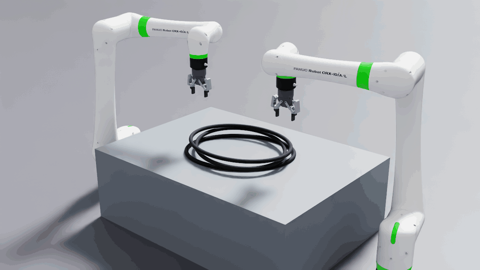
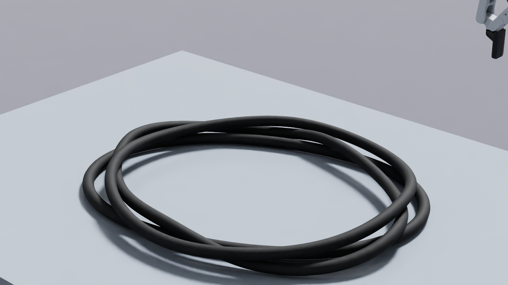
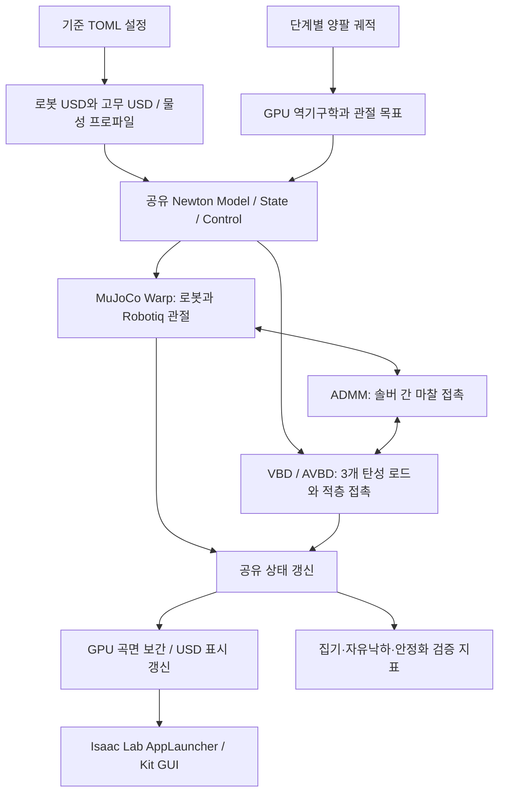

# Newton VBD WeatherStrip

[English](README.md) | [한국어](README_KR.md)

**Newton VBD와 MuJoCo Warp로 구현한 양팔 로봇의 차량 도어 웨더스트립 집기·인장·자유낙하 시뮬레이션**

FANUC CRX-10iA/L 두 대와 Robotiq 2F-85 그리퍼가 테이블에 쌓인 웨더스트립 세 개 중 맨 위 하나를 집습니다. 들어 올려 양쪽으로 늘리고, 다시 느슨하게 늘어뜨린 다음 공중에서 그리퍼를 열어 아래 두 개 위로 떨어뜨립니다. 로봇 관절, 탄성 변형, 마찰 접촉, 중력 낙하를 계산하고 그 결과를 Isaac Lab GUI에 표시합니다.



*Newton 1.6.0 / Warp 1.17.0의 실제 Isaac Lab 뷰포트 기록입니다. 집기 → 들어 올리기 → 인장 → 복원 → 개방·자유낙하 → 적층 안정화를 반복 재생합니다. 60 Hz 물리 상태를 4프레임마다 캡처해 15 FPS로 재생하므로 물리 시간 기준 1배속이며, GUI 처리 속도를 뜻하지 않습니다.*

| 항목 | 구현 |
| --- | --- |
| 로봇 / EEF | FANUC CRX-10iA/L × 2 / Robotiq 2F-85 × 2 |
| 탄성체 | 폐곡선 타원형 도어 씰 × 3, 개당 64개 로드 구간 |
| 고무 계산 | Newton `SolverVBD`의 강체 로드·케이블 / AVBD 경로 |
| 로봇 계산 | Newton `SolverMuJoCo` → MuJoCo Warp GPU 백엔드 |
| 솔버 간 상호작용 | `SolverCoupledADMM`의 마찰 접촉 결합 |
| 표시 | Isaac Lab `AppLauncher` + Kit 뷰포트 + USD 갱신 |
| 검증 상태 | GPU 전체 동작, 장시간 안정화, GUI 반복 동작, USD 및 CPU 회귀 검증 |

> **제공 범위:** 설치·실행·검증 가능한 SimReady 참조 예제입니다. 실측 EPDM 물성으로 보정한 디지털 트윈이나 공식 SimReady 인증 자산은 아닙니다. Isaac Lab의 `DirectRLEnv` 학습 환경 또는 기본 `NewtonManager` 통합 환경도 아닙니다.

## 목차

- [1. 시나리오와 구현 범위](#1-시나리오와-구현-범위)
- [2. 시스템 구조](#2-시스템-구조)
- [3. 물리 모델과 솔버 이론](#3-물리-모델과-솔버-이론)
- [4. SimReady 자산 제작 과정](#4-simready-자산-제작-과정)
- [5. 개발 순서와 설계 판단](#5-개발-순서와-설계-판단)
- [6. 설치](#6-설치)
- [7. 실행](#7-실행)
- [8. 설정과 튜닝](#8-설정과-튜닝)
- [9. 검증과 성능](#9-검증과-성능)
- [10. 저장소 구성](#10-저장소-구성)
- [11. 문제 해결](#11-문제-해결)
- [12. 확장과 모델의 한계](#12-확장과-모델의-한계)
- [13. 참고 문헌과 라이선스](#13-참고-문헌과-라이선스)

## 1. 시나리오와 구현 범위

기본 사이클의 물리 시간은 **13.05초**입니다. `Play`로 한 사이클을 실행하고, 완료 후에는 결과를 관찰할 수 있도록 일시정지합니다. `Reset`은 상태뿐 아니라 솔버의 내부 접촉·반복 계산 이력까지 다시 구성합니다.

| 단계 | 시간 | 수행 내용 |
| --- | ---: | --- |
| 준비 / 접근 | 0.80 / 0.70 s | 세 고무가 중력과 접촉으로 자리 잡고, 양팔이 최상단 고무로 접근 |
| 집기 | 1.00 s | Robotiq 주 관절을 닫아 양쪽 끝에 마찰 접촉 형성 |
| 들어 올리기 | 2.00 s | 집었던 XY 위치를 유지하면서 상승 |
| 늘리기 / 유지 | 1.20 / 0.50 s | 각 손을 바깥으로 80 mm 이동하고 인장 상태 유지 |
| 복원 / 늘어뜨리기 | 1.00 / 0.80 s | 손 간격을 줄이고 25 mm 내려 고무가 다시 처지게 함 |
| 개방 / 낙하 대기 | 0.45 / 1.00 s | 공중에서 그리퍼를 열고 고무가 중력으로 떨어지도록 대기 |
| 후퇴 / 안정화 | 0.60 / 3.00 s | 그리퍼를 치우고 아래 두 고무 위에서 안정화 |

- 세 고무 모두 동적 물체입니다. 아래 두 고무도 충돌과 하중에 반응합니다.
- 고무와 그리퍼 사이에 임시 고정 관절, attachment, 좌표 덮어쓰기를 사용하지 않습니다.
- 현재 집기 위치는 시뮬레이터가 제공하는 고무 구간 위치에서 추정합니다. 카메라 기반 인식이나 실제 센서 피드백은 포함하지 않습니다.
- 궤적은 결정적인 단계별 계획이지만, 실제 변형·미끄러짐·낙하는 접촉 해석 결과입니다. 장비나 계산 순서에 따라 수치 결과에 작은 차이가 생길 수 있습니다.



*동일 GUI 사이클의 낙하·안정화 결과. 고무를 정지 상태로 강제 고정하거나 수면 처리해서 만든 형상이 아닙니다.*

## 2. 시스템 구조



### 역할 분리

`simulation.py`는 로봇과 고무를 하나의 Newton 모델에 조립한 뒤, 소유할 body와 joint 목록을 각 솔버에 명시합니다.

- **MuJoCo Warp 소유:** 양팔과 그리퍼의 총 32개 body, 24개 관절 좌표, 10개 mimic 제약.
- **VBD 소유:** 세 고무의 총 192개 로드 body와 192개 폐곡선 케이블 joint.
- **ADMM 소유:** 서로 다른 솔버가 담당하는 물체 사이의 접촉 인터페이스.
- **정적 환경:** 테이블과 바닥은 고정된 충돌 형상입니다.

물리 상태를 계산한 뒤에만 렌더링 표면을 갱신합니다. 화면 표시가 고무의 물리 위치를 결정하지 않습니다. Kit의 표준 타임라인은 사용자 입력과 진행 시간 표시를 담당하며, 이 장면을 PhysX가 동시에 적분하지 않습니다.

기본값은 표시 프레임당 8개 물리 substep입니다.

$$
\Delta t_{\mathrm{frame}}=\frac{1}{60}\;\mathrm{s},\qquad
h=\frac{1}{60\times8}\approx2.083\;\mathrm{ms}
$$

각 substep에서 충돌 검출 → ADMM 결합 계산 → 관절 상태 갱신을 수행합니다. 기본 반복 수는 VBD 8회, ADMM 4회, MuJoCo CG 8회입니다. 이 값들은 서로 다른 반복 루프에 속하므로 하나의 통합 반복 횟수로 해석하면 안 됩니다.

## 3. 물리 모델과 솔버 이론

### 3.1 폐곡선 로드로 근사한 도어 웨더스트립

중심선의 초기 형상은 다음 타원입니다.

$$
\mathbf p_i=
\begin{bmatrix}
a\cos\theta_i & b\sin\theta_i & z_0
\end{bmatrix}^{\mathsf T},\qquad
\theta_i=\frac{2\pi i}{N}
$$

기본값은 $a=0.28$ m, $b=0.22$ m, $N=64$입니다. 외경은 20 mm, 개당 질량은 0.40 kg입니다. `ModelBuilder.add_rod(..., closed=True)`로 각 구간의 강체 캡슐과 케이블 관절을 만들고 마지막 구간을 처음 구간에 연결합니다. 개별 캡슐은 강체지만, 연결부의 인장·전단·굽힘·비틀림 변형으로 전체 고무가 탄성체처럼 움직입니다.

이는 중공 벌브와 립을 가진 실제 씰을 **원형 단면의 1차원 탄성 로드**로 축약한 모델입니다. 외형이 두꺼워 보여도 체적 FEM이나 단면 압축 해석을 수행하는 것은 아닙니다.

| 모드 | 물리적 의미 | 기본 강성 | 기본 감쇠 |
| --- | --- | ---: | ---: |
| 인장 | 구간 사이 축 방향 길이 변화 | 5,000 N/m | 0.10 N·s/m |
| 전단 | 중심선에 수직인 상대 변위 | 5,000 N/m | 0.10 N·s/m |
| 굽힘 | 인접 구간 방향의 변화 | 1.20 N·m/rad | 0.024 N·m·s/rad |
| 비틀림 | 로드 축 주위 상대 회전 | 0.40 N·m/rad | 0.008 N·m·s/rad |

변위와 회전이 작은 경우를 설명하는 등가 관계는 다음과 같습니다. 실제 솔버는 구간의 3차원 위치와 회전을 함께 사용합니다.

$$
f_s\approx k_s\Delta\ell+c_s\Delta\dot\ell,\qquad
\tau_b\approx k_b\Delta\theta+c_b\Delta\dot\theta
$$

USD 물성 작성 시 평균 구간 길이 $\bar\ell$과 원형 단면의 기하량을 사용해 등가 계수로 변환합니다.

$$
A=\pi r^2,\qquad I=\frac{\pi r^4}{4},\qquad J=\frac{\pi r^4}{2}
$$

$$
E_s\approx\frac{k_s\bar\ell}{A},\quad
G_s\approx\frac{k_{\mathrm{shear}}\bar\ell}{A},\quad
E_b\approx\frac{k_b\bar\ell}{I},\quad
G_t\approx\frac{k_t\bar\ell}{J}
$$

여기서 $E_s,E_b,G_s,G_t$는 독립적으로 조정된 **등가 계수**입니다. 실제 균질 등방성 고무의 단일 Young 계수와 Poisson 비를 식별한 값이 아닙니다. 런타임은 TOML/JSON에 기록한 구간 강성을 사용합니다. 구간 수나 단면을 바꿀 때에는 기존 강성을 그대로 복사하지 말고 길이·단면 스케일과 동작 검증을 다시 확인해야 합니다.

질량은 원통 구간 체적 합으로 맞춥니다. 캡슐 충돌 형상의 반구 끝부분을 중복 질량으로 더하지 않습니다. 따라서 계산에 사용되는 등가 밀도를 실측 EPDM 재료 밀도로 해석해서는 안 됩니다.

### 3.2 VBD와 AVBD

VBD(Vertex Block Descent)는 암시적 시간 적분의 변분 문제를 작은 블록의 반복 최적화로 푸는 방법입니다. 입자 위치 $\mathbf x$에 대한 대표적인 설명식은 다음과 같습니다.

$$
\mathbf x^{n+1}=\arg\min_{\mathbf x}
\left[
\frac{1}{2h^2}(\mathbf x-\mathbf y)^{\mathsf T}M(\mathbf x-\mathbf y)
+E(\mathbf x)
\right]
$$

$\mathbf y$는 관성 예측 위치이고, $E$는 탄성·접촉 등의 에너지입니다. 전체 자유도를 한꺼번에 푸는 대신, 나머지 블록을 고정한 상태에서 각 블록의 기울기와 국소 Hessian을 이용해 에너지를 줄입니다. 서로 직접 연결되지 않은 블록을 graph coloring으로 묶으면 같은 색의 블록을 GPU에서 병렬 계산할 수 있습니다. [VBD 원 논문](https://graphics.cs.utah.edu/research/projects/vbd/)

이 프로젝트의 고무는 입자 체적 메시가 아니라 강체 로드이므로, Newton `SolverVBD` 안의 **강체 AVBD(Augmented VBD) 경로**를 사용합니다. 로드 블록에는 병진뿐 아니라 회전도 포함됩니다. AVBD는 augmented Lagrangian 상태를 이용해 강한 접촉·관절 제약을 다룹니다. 개념적으로 제약 $C$에 대해 다음 항을 추가합니다.

$$
\mathcal L_{\mathrm{aug}}=E+\lambda^{\mathsf T}C+\frac{\rho_c}{2}\lVert C\rVert^2
$$

기본 구현에서 케이블의 인장·전단·굽힘·비틀림은 유한 강성을 가진 soft 모드이며, 강체 접촉은 hard 모드를 사용합니다. `builder.color()`가 필수이고, 감쇠 계수 `kd`는 절대 물리 단위로 해석합니다. [Newton SolverVBD API](https://newton-physics.github.io/newton/1.6.0/api/_generated/newton.solvers.SolverVBD.html), [AVBD 원 논문](https://graphics.cs.utah.edu/research/projects/avbd/)

VBD 논문의 안정성 논의를 곧바로 이 전체 장면의 무조건적인 성공 보장으로 확대하면 안 됩니다. 본 장면은 유한 반복, 접촉 검출, 관절 구동, 서로 다른 솔버의 결합을 포함합니다. 반복 수를 너무 줄이거나 접촉 강성을 과도하게 높이면 미끄러짐·잔진동·제약 오차가 발생할 수 있습니다.

### 3.3 MuJoCo Warp로 계산하는 로봇과 그리퍼

MJWarp는 MuJoCo의 동역학 계산을 NVIDIA GPU에서 수행하는 백엔드입니다. 여기서는 Newton의 `SolverMuJoCo`가 모델과 상태 변환을 담당합니다. 관절계의 관계를 개념적으로 쓰면 다음과 같습니다.

$$
M(q)\ddot q+h(q,\dot q)=\tau_{\mathrm{drive}}+J(q)^{\mathsf T}\lambda+\tau_{\mathrm{ext}}
$$

역기구학은 원하는 양손 위치·방향에 대한 관절 목표를 만들고, 실제 관절은 구동력과 제약을 통해 그 목표를 추종합니다. 따라서 IK가 고무를 직접 움직이는 구조가 아닙니다.

| 설정 | 값 / 역할 |
| --- | --- |
| 백엔드 | MuJoCo Warp, `use_mujoco_cpu=False` 기본 경로 |
| 관절 제약 해법 / 적분 | `cg` / `implicitfast` |
| MuJoCo 반복 / line search | 8 / 4 |
| native 접촉 검출 | `use_mujoco_contacts=False` |
| Robotiq 개방 / 닫힘 목표 | 0 / 0.78 rad |
| 주 관절 구동 강성 / 감쇠 | 180 N·m/rad / 8 N·m·s/rad |
| 주 관절 토크 한도 | 26 N·m |
| mimic 제약 | 그리퍼당 5개, 양쪽 합계 10개 |

Robotiq의 주 관절 하나를 구동하면 mimic equality가 나머지 손가락 관절을 연동합니다. 이 예제는 접촉 하중 아래에서 수동 관절이 과도하게 벌어지지 않도록 `eq_solref=[0.004,1.0]`, `eq_solimp=[0.99,0.99,0.001,0.5,2.0]`를 설정합니다. 이는 예제의 솔버 튜닝값이며 제조사 제어기 사양을 재현한 값은 아닙니다.

`use_mujoco_contacts=False`는 모든 접촉을 끈다는 의미가 아닙니다. Newton/결합 솔버가 관리하는 접촉 경로를 사용한다는 뜻입니다. 특히 고무–그리퍼의 교차 솔버 접촉은 다음 ADMM 인터페이스가 담당합니다. [Newton MuJoCo 문서](https://newton-physics.github.io/newton/1.6.0/solvers/mujoco.html), [MuJoCo Warp](https://github.com/google-deepmind/mujoco_warp)

### 3.4 ADMM으로 두 솔버 결합하기

ADMM(Alternating Direction Method of Multipliers)은 결합된 문제를 부분 문제로 나누어 각 부분과 인터페이스 변수를 번갈아 갱신하는 방법입니다. 일반적인 두 블록 문제를 설명하면 다음과 같습니다.

$$
\min_{x,z}\; f(x)+g(z)\quad\text{subject to}\quad Ax+Bz=c
$$

$$
\begin{aligned}
x^{k+1}&=\arg\min_x f(x)+\frac{\rho}{2}\lVert Ax+Bz^k-c+u^k\rVert^2\\
z^{k+1}&=\arg\min_z g(z)+\frac{\rho}{2}\lVert Ax^{k+1}+Bz-c+u^k\rVert^2\\
u^{k+1}&=u^k+Ax^{k+1}+Bz^{k+1}-c
\end{aligned}
$$

위 식은 알고리즘의 분할 원리를 설명하기 위한 것입니다. Newton의 실제 강체 접촉 구현이 위치 벡터에 이 식을 그대로 적용하는 것은 아닙니다. `ModelView`, 솔버별 상태, 힘 주입, 유효 질량과 proximal 항, 접촉 행 및 dual 변수를 함께 사용합니다. [ADMM 참고 문헌](https://stanford.edu/~boyd/papers/admm_distr_stats.html)

본 코드의 설정은 다음과 같습니다.

```python
SolverCoupledADMM.Config(
    iterations=4,
    rho=200.0,
    gamma=0.001,
    baumgarte=0.5,
    rigid_contact_matching="latest",
    contact_matching_force_scale=0.9,
    contact_pairs=[
        SolverCoupledADMM.ContactPair(source="mjc", destination="vbd"),
    ],
)
```

ADMM은 소유권이 다른 물체의 접촉 행을 내부 검출 경로에서 구성하고, 마찰 접촉에서 최대 소산을 따르는 Coulomb 투영을 사용합니다. VBD가 계산하는 고무끼리의 접촉과 이 교차 접촉을 구분해야 합니다. `rho`는 인터페이스의 수치적 penalty이며 고무의 Young 계수나 N/m 단위의 접촉 스프링 강성과 동일한 값이 아닙니다. 고정된 반복 예산을 사용하므로 매 substep의 완전 수렴을 주장하지 않습니다. [Newton 결합 솔버 문서](https://newton-physics.github.io/newton/1.6.0/concepts/coupling.html)

### 3.5 적층 안정화와 접촉 계수

초기 적층 간격은 25 mm입니다. 아래 고무 두 개는 각각 +30°, −30°로 회전해 원형 단면끼리의 지지점을 만들고, 맨 위 고무는 0°로 놓습니다. 인접한 같은 고무 구간의 중복 자기충돌만 제외하고, 떨어진 구간과 서로 다른 고무 사이의 충돌은 유지합니다.

최종 설정에서는 **고무–고무 및 고무–테이블의 VBD 접촉 강성을 50,000에서 5,000 N/m로 낮춰** 접촉부의 수치적 떨림을 줄였습니다. 굽힘 강성은 1.20 N·m/rad로 유지하여 전체 타원이 지나치게 흐물거리지 않게 했습니다. 즉, 중심선의 형상 복원과 접촉부의 응답을 별도로 조정했습니다.

- VBD 접촉 감쇠: 10 N·s/m.
- 고무 형상 마찰 계수: 2.0, 테이블 형상 마찰 계수: 0.15.
- VBD는 강성·감쇠를 산술 평균, 마찰을 기하 평균으로 혼합합니다. 따라서 고무–테이블의 VBD 혼합 마찰은 $\sqrt{2.0\times0.15}\approx0.548$입니다.
- 충돌 margin은 1 mm, gap은 2 mm입니다. 표시 표면과 접촉 경계가 정확히 같은 위치인 모델은 아닙니다.
- `gripper_contact_*`는 형상 재질에 작성하는 **명목상 접촉쌍 계수**입니다. 이를 ADMM 교차 접촉의 유효 강성으로 읽으면 안 됩니다. 실제 그립은 ADMM 설정, 구동, mimic 제약, 마찰, 집기 위치까지 함께 영향을 받습니다.

잔진동을 줄이기 위해 고무 속도를 강제로 0으로 만들거나 정지 body로 바꾸지 않습니다. 렌더링 표면에도 시간적 흔들림 제거 필터를 적용하지 않습니다.

### 3.6 물리 해상도와 시각 해상도 분리

물리 계산은 개당 64개 로드 구간을 사용합니다. 표시는 실제 구간 중심을 따라 주기적인 Catmull–Rom 곡선을 만들고, 256개 단면 × 16개 원주 점으로 표면을 구성합니다. 개당 4,096개 정점입니다.

GPU에서 보간과 단면 프레임·법선을 계산하고, 세 고무의 결과를 한 번에 CPU로 가져와 USD를 갱신합니다. 단면 프레임은 평행 이동 방식으로 이어 급격한 법선 뒤집힘을 줄입니다. 이 방법은 그리퍼 주변이 연결된 사슬처럼 보이는 문제를 줄이면서 물리 로드 수를 늘리지 않습니다. 표시 표면은 충돌 메시가 아닙니다.

## 4. SimReady 자산 제작 과정

이 예제에서 SimReady 자산은 단순히 보기 좋은 USD 하나가 아니라, **형상·단위·물성·충돌·좌표계·출처·런타임 계약·검증 결과**를 함께 갖춘 묶음입니다.

| 순서 | 작업 | 이 저장소의 산출물 / 통과 기준 |
| --- | --- | --- |
| 1 | 요구 동작과 허용 근사 정의 | 3개 적층, 최상단 집기, 탄성 인장, 공중 개방, 자연 낙하 |
| 2 | 원본 자산과 버전 고정 | `assets/manifest.json`; 공식 URL, commit, 파일별 SHA-256 |
| 3 | 좌표계·단위 정리 | SI 단위, Z-up, 유효한 default prim, 로봇 flange와 그립 좌표 정렬 |
| 4 | 물리용 중심선과 위상 작성 | 타원형 periodic curve, 중복 끝점 처리, 폐곡선 64개 joint |
| 5 | 단면·질량·물성 작성 | 반경, 총질량, 인장·전단·굽힘·비틀림 강성 및 감쇠 |
| 6 | 충돌 정책 작성 | 캡슐 반경, margin/gap, 같은 씰의 이웃 구간 제외, 씰 간 충돌 유지 |
| 7 | 표시 자산 작성 | 검은 고무 재질, 연속 표면·법선, grasp site 메타데이터 |
| 8 | 독립 import 검증 | 질량, 폐곡선 연결, 좌표계, 정상 법선, 누락된 USD 의존성 검사 |
| 9 | 상호작용 검증 | 실제 접촉 집기, 두 하단 씰 비상승, 자유낙하와 착지·안정화 |
| 10 | 배포 패키징 | 재현 가능한 설치·다운로드, 버전 고정, 자동 검증, 실행 문서 |

### 자산 묶음

```text
assets/weatherstrip/
├── weatherstrip.usda    # 재사용 가능한 단일 웨더스트립
└── runtime.json         # 정확한 구간 강성·감쇠·질량과 런타임 가정
```

USD의 주요 prim은 다음과 같습니다.

```text
/Weatherstrip
├── Physics/Centerline
├── Physics/NeighborExclusions
├── Visual/Surface
├── Looks/RubberPhysics
├── Looks/RubberSurface
└── GraspSites/{Left,Right}
```

`PhysicsCurvesDeformableSimAPI`와 관련 curve material 속성은 고정한 Newton 버전이 읽는 제안 스키마입니다. 모든 USD 소비자가 이 고무를 자동으로 같은 물리 모델로 실행한다는 뜻은 아닙니다. 단일 자산의 standalone importer 검증과, `runtime.json`의 구간 계수를 사용해 세 개를 조립하는 본 런타임의 동작 검증을 구분합니다.

`load_weatherstrip_points()`는 USD에서 중심선을 읽고 현재 설정과 `runtime.json`의 물성 일치를 확인합니다. 물성을 수정한 뒤 자산을 재생성하지 않으면 실행을 중단합니다. 오래된 USD와 새로운 물리 설정이 섞이는 것을 방지하기 위한 계약입니다.

## 5. 개발 순서와 설계 판단

새로운 변형체 조작 예제를 개발할 때에는 다음 순서로 문제를 분리하는 것이 좋습니다.

1. **단일 자산 검증:** 로봇을 붙이기 전에 좌표계, 질량, 폐곡선 연결, 자기충돌 제외와 낙하를 확인합니다.
2. **로봇·EEF 조립 검증:** flange 방향과 길이, EEF 원점, 관절 수, mimic 수, 개방/닫힘 한도를 확인합니다. 이 예제의 J6 장착 변환은 +X 160 mm와 Y축 90° 회전입니다.
3. **접촉 집기 검증:** 고무를 붙잡는 attachment 없이 양쪽 손가락 접촉을 확인합니다. 실제 mesh의 닫힌 패드 범위를 조사한 후 집기 깊이를 17 mm로 설정했습니다. 패드 끝에 걸치면 작은 수치 차이에도 미끄러질 수 있습니다.
4. **단일 고무 인장 검증:** 집기 위치에서 순수 수직 상승한 뒤 양쪽으로 늘립니다. 상승 단계에 불필요한 XY 이동이 섞이면 집기가 풀릴 수 있습니다.
5. **적층으로 확장:** 아래 두 고무의 운동과 접촉을 유지하며 최상단만 집히는지 확인합니다. 최고 높이 하나만 보는 대신 하단 고무의 질량 중심 상승도 검사합니다.
6. **개방·자유낙하 검증:** 공중 개방 후 그리퍼·테이블·하단 고무와 접촉하지 않는 구간이 실제로 존재하는지 확인하고, 이후 하단 고무와 착지 접촉이 생기는지 추적합니다.
7. **안정화 조정:** 복원 강성, 재료 감쇠, 접촉 강성, 시간 간격과 반복 수를 구분합니다. 감쇠만 과도하게 높이면 집기와 복원 동작 자체가 달라질 수 있습니다.
8. **표시 품질 개선:** 물리 상태와 분리된 곡면 보간을 적용하고 폐곡선 연결·반경·법선을 테스트합니다.
9. **성능 개선:** 실제 측정으로 CUDA 실행, CPU 전송, USD 쓰기, Kit 표시 비용을 나눕니다. 버퍼와 반복 수를 줄인 뒤에는 반드시 전체 사이클을 재검증합니다.
10. **배포 검증:** 깨끗한 Python 환경, 공식 자산 재다운로드, 저장소 밖에서의 실행, 실제 GUI와 기록 USD를 확인합니다.

현재 프로젝트는 3개 적층 시나리오를 검증 대상으로 고정합니다. 단순히 `stack_count`만 늘려 여러 개의 씰로 일반화하는 인터페이스는 제공하지 않습니다.

## 6. 설치

### 6.1 검증 환경과 요구 조건

| 항목 | 검증한 구성 |
| --- | --- |
| OS | Ubuntu 24.04.4 LTS, Linux x86-64 |
| Python | 3.12 |
| GPU / 드라이버 | NVIDIA RTX 6000 Ada 48 GB / 595.91.07 |
| Newton | 1.6.0, upstream tag `v1.6.0` |
| Warp | 1.17.0 |
| MuJoCo / MuJoCo Warp | 각각 3.12.0 |
| NumPy / OpenUSD | 2.3.1 / `usd-core` 25.11 |
| Isaac Sim | 6.0.1.0 |
| Isaac Lab 소스 | commit `2e44ddb2e19536579140496023b5ccb060bc4152` |
| 해당 Isaac Lab Python 메타데이터 버전 | 6.1.17 |
| GUI 환경의 PyTorch | 2.11.0+cu128 |

NVIDIA CUDA GPU와 호환 드라이버가 필요합니다. Isaac Lab GUI에는 Vulkan/RTX 표시가 가능한 GPU와 정상적인 데스크톱 세션이 필요합니다. 위 표는 최소 사양이 아니라 실제 검증 환경이며, 다른 GPU에서 동일 FPS를 보장하지 않습니다. Windows·ARM 환경은 이 저장소에서 검증하지 않았습니다.

**계산 전용 환경과 GUI 환경을 나누어 설치하는 것을 권장합니다.** GUI를 보지 않는 물리 검증에는 Isaac Sim, Isaac Lab, PyTorch가 필요하지 않습니다.

### 6.2 계산 전용 설치 — 새 환경에서 검증한 경로

```bash
git clone git@github.com:nv-jonghwan/NewtonVBD_WeatherStrip.git
cd NewtonVBD_WeatherStrip

python3.12 -m venv .venv
source .venv/bin/activate
python -m pip install --upgrade pip
python -m pip install -c requirements/compute-constraints.txt -e .

# 공식 자산 15개 파일 다운로드 + SHA-256 검증
python scripts/fetch_assets.py

# 웨더스트립 생성 및 USD 물리 import 검증
./scripts/python.sh scripts/build_asset.py
./scripts/python.sh scripts/validate_asset.py
./scripts/python.sh -m newton_weatherstrip.doctor --runtime --import-smoke

# GPU에서 전체 시나리오 계산, JSON과 USD 저장
./scripts/run_headless.sh
```

GitHub SSH 키를 사용하지 않는 환경은 clone URL을 `https://github.com/nv-jonghwan/NewtonVBD_WeatherStrip.git`로 바꿀 수 있습니다.

`fetch_assets.py`는 버전과 체크섬이 고정된 FANUC·Robotiq 파일만 받습니다. 이미 있는 파일의 체크섬이 다르면 덮어쓰지 않고 오류를 냅니다. 네트워크 없이 기존 파일을 검사하려면 다음을 사용합니다.

```bash
python scripts/fetch_assets.py --offline
```

### 6.3 Isaac Lab GUI 환경

**기존에 동작하는 Isaac Sim 6.0.1 환경이 있으면 그 Python을 사용하십시오.** 새 GUI 환경을 만드는 경우의 구성 명령은 다음과 같습니다. Isaac Sim 다운로드는 계산 전용 환경보다 훨씬 크며, NVIDIA 배포 서버 접근이 필요합니다.

```bash
python3.12 -m venv .venv-gui
source .venv-gui/bin/activate
python -m pip install --upgrade pip

python -m pip install "isaacsim[all,extscache]==6.0.1.0" \
  --extra-index-url https://pypi.nvidia.com
python -m pip install "torch==2.11.0" \
  --index-url https://download.pytorch.org/whl/cu128
python -m pip install toml==0.10.2 packaging==26.0
python -m pip install -e .

# AppLauncher와 Kit 앱 설정을 사용하는 고정 소스 체크아웃
git clone https://github.com/isaac-sim/IsaacLab.git .cache/IsaacLab
git -C .cache/IsaacLab checkout 2e44ddb2e19536579140496023b5ccb060bc4152

export WEATHERSTRIP_PYTHON="$PWD/.venv-gui/bin/python"
export WEATHERSTRIP_ISAACLAB="$PWD/.cache/IsaacLab"
./scripts/run_isaaclab.sh
```

이 예제는 `AppLauncher`만 사용하고 학습 환경의 전체 설치 집합을 요구하지 않습니다. 실행 래퍼가 `WEATHERSTRIP_ISAACLAB/source/*`를 Python 경로에 추가합니다. 해당 Isaac Lab commit의 전체 `setup.py`에는 Warp 1.13.0 의존성이 있으므로, 이를 무조건 함께 설치하면 본 예제의 Newton 1.6 / Warp 1.17 조합과 충돌합니다. 학습용 Isaac Lab 환경에 통합할 때에는 별도 호환성 검증이 필요합니다.

GUI 검증에는 기존 Isaac Sim 설치와 **수정하지 않은 고정 Isaac Lab 소스**를 사용합니다. 위 GUI 패키지 전체를 모든 시스템에서 자동 설치해 주는 통합 설치기나 Docker 이미지를 제공하는 것은 아닙니다. NVIDIA EULA 확인과 첫 실행 shader 준비는 Isaac Sim의 안내를 따릅니다. [Isaac Lab 설치 안내](https://isaac-sim.github.io/IsaacLab/v3.0.0-beta2/source/setup/installation/pip_installation.html)

### 6.4 Python과 GPU 선택

`./scripts/python.sh`의 Python 선택 우선순위는 다음과 같습니다.

1. `WEATHERSTRIP_PYTHON`으로 명시한 실행 파일.
2. 저장소의 `.venv/bin/python`.
3. 선택적으로 연결한 `.workspace/toolchain/bin/activate`의 환경.
4. 현재 `PATH`의 `python3`.

따라서 `.venv`와 `.venv-gui`가 모두 있으면 GUI 실행 시 `WEATHERSTRIP_PYTHON`을 지정해야 합니다. 워크스테이션 전용 `.workspace/` 연결은 Git에 포함하지 않으며, 일반 사용자는 필요하지 않습니다.

```bash
# 계산 전용: 물리 GPU 1개만 노출 → 프로세스 내부에서는 cuda:0
WEATHERSTRIP_GPU=1 ./scripts/run_headless.sh

# GUI: 화면 출력 GPU 0, 물리 GPU 1을 따로 사용
WEATHERSTRIP_PYTHON="$PWD/.venv-gui/bin/python" \
WEATHERSTRIP_ISAACLAB="$PWD/.cache/IsaacLab" \
WEATHERSTRIP_DEVICE=cuda:1 WEATHERSTRIP_RENDER_GPU=0 \
./scripts/run_isaaclab.sh
```

기본 GUI는 물리와 표시에 GPU 0을 사용합니다. GUI 래퍼는 디스플레이 GPU를 숨기지 않도록 `CUDA_VISIBLE_DEVICES`를 해제합니다. 계산 전용 래퍼는 사용자가 설정한 장치 가시성을 존중합니다.

## 7. 실행

### GUI

```bash
./scripts/run_isaaclab.sh

# 자동 실행 후 5.8초 부근에서 멈춰 인장 장면 관찰
./scripts/run_isaaclab.sh --auto-play --pause-at 5.8
```

`Newton VBD | WeatherStrip` 패널에서 다음을 사용합니다.

- **Play / Pause / Reset:** 전체 동작 시작, 일시정지, 초기 상태 재구성.
- **Scene view / Seal close-up:** 로봇 전체 장면과 고무 상세 보기.
- **Save screenshot:** 현재 뷰포트를 `results/weatherstrip_날짜_시간.png`에 저장.
- 상태 표시: 동작 단계, 물리 시간, 고무 폭, FPS, 물리·USD 갱신 비용.

60 Hz는 물리 시간 간격의 기준입니다. 예를 들어 GUI가 20 FPS이면 물리 시간 1초를 진행하는 데 실제 약 3초가 걸립니다. GUI FPS와 실시간 배속 1.0을 혼동하지 않아야 합니다.

### README 동작 GIF 재생성

GUI 환경과 FFmpeg가 필요합니다. 프레임 폴더는 비어 있어야 하며, 완료·물리 검증에 통과한 기록만 GIF로 변환합니다. 카메라는 기록 동안 고정됩니다.

```bash
./scripts/run_isaaclab.sh --capture-dir results/demo-frames \
  --camera scene --capture-stride 4 --exit-after-cycle
python3 scripts/make_demo_gif.py results/demo-frames results/dual-arm-cycle.gif
```

생성 파일을 확인한 뒤 `docs/media/dual-arm-cycle.gif`로 복사합니다. `capture.json`에는 엔진 버전, 물리 시간, 단계별 프레임과 검증 결과가 기록됩니다. GIF는 960 px 너비, 15 FPS, 무한 반복이며 원본 PNG는 Git에 포함하지 않습니다.

### 기록과 검증

```bash
# 기본 전체 사이클과 기록 USD
./scripts/run_headless.sh

# USD 기록 비용 없이 물리만 검증
./scripts/run_headless.sh --viewer null \
  --metrics-path results/physics_only.json

# 완료 후에도 20초까지 계속 계산하여 적층 안정성 확인
./scripts/run_headless.sh --num-frames 1200 \
  --output-path results/long_settle.usd \
  --metrics-path results/long_settle.json

# 기록된 3개 표면과 모든 법선/의존성 검사
./scripts/python.sh scripts/validate_recording.py results/long_settle.usd
```

기본 출력은 `results/metrics.json`과 `results/weatherstrip_cycle.usd`입니다. 전체 사이클의 판정은 JSON의 `validation_passed`로 확인합니다. 짧은 smoke 실행은 초기화와 유한 상태만 확인하므로 전체 시나리오 합격을 의미하지 않습니다.

### 다른 설정 사용

```bash
cp config/default.toml config/my_scene.toml
# config/my_scene.toml 수정
./scripts/python.sh scripts/build_asset.py --config config/my_scene.toml
./scripts/python.sh scripts/validate_asset.py --config config/my_scene.toml
./scripts/run_headless.sh --config config/my_scene.toml
./scripts/run_isaaclab.sh --config config/my_scene.toml
```

자산 생성 경로는 공통 `assets/weatherstrip/`입니다. 서로 다른 물성 설정을 동시에 실행하려면 별도 체크아웃을 사용하십시오. 다른 설정으로 자산을 만든 뒤 기본 설정을 실행하면 의도적으로 프로파일 불일치 오류가 발생합니다.

## 8. 설정과 튜닝

기준 설정은 [config/default.toml](config/default.toml)에 있습니다.

| 변경 목적 | 먼저 볼 설정 / 코드 | 함께 확인할 사항 |
| --- | --- | --- |
| 고무가 더 잘 늘어나게 | `stretch_stiffness_n_m`, `shear_stiffness_n_m` | 늘어난 폭, 그립 이탈, 시간 간격 |
| 타원 형상 유지 | `bend_stiffness_n_m`, `twist_stiffness_n_m` | 복원 속도와 들어 올릴 때의 처짐 |
| 오래 남는 진동 감소 | 재료 감쇠, `contact_stiffness_n_m`, `contact_damping_n_s_m` | 마지막 1초 RMS 속도, 그립·낙하 회귀 |
| 두께 변경 | `cross_section_radius_m` | 질량/밀도, 이웃 충돌, 적층 간격, 패드 위치, USD 재생성 |
| 그립 이탈 감소 | `grip_depth_m`, 구동 목표, mimic 및 ADMM 설정 | 실제 패드 중앙 정렬, 아래 씰 오집기 |
| 계산 정확도 조정 | `substeps`, `solver_iterations`, `admm_iterations`, `mujoco_iterations` | 전체 동작 합격과 버퍼 초과 |
| 접촉 수 증가 | `CollisionPipeline(..., rigid_contact_max=8192)` | `peak_rigid_contacts`와 로그의 overflow |
| 표시 품질 | `skin.py`, `presentation.py` | 물리 구간 수와 별개로 법선·폐곡선 검증 |

**변수 하나의 효과를 확인한 뒤 전체 사이클을 다시 검증하는 방식**이 유용합니다. 접촉 강성을 높이는 것은 단순한 정확도 향상이 아닙니다. 수치적 조건을 악화시키거나 더 작은 substep·많은 반복을 요구할 수 있습니다. 반대로 낮은 반복 수에서 한 번 집기에 성공했다고 모든 환경에서 같은 안정성을 얻는 것도 아닙니다.

## 9. 검증과 성능

### 자동 검증

```bash
./scripts/python.sh -m unittest discover -s tests -v
./scripts/python.sh scripts/validate_asset.py
./scripts/python.sh -m newton_weatherstrip.doctor --runtime --import-smoke
./scripts/run_headless.sh
```

GitHub Actions는 CPU에서 표면 회귀, 자산 manifest 무결성, Python 및 shell 문법을 확인합니다. **GPU 동작이나 Kit GUI를 GitHub 일반 CPU runner에서 검증한다고 주장하지 않습니다.**

전체 동작 검증에는 다음 조건이 포함됩니다.

| 검증 항목 | 기본 통과 기준 |
| --- | --- |
| 수치 상태 | body / joint 상태에 NaN·Inf 없음 |
| 양쪽 집기 | 실제 충돌 접촉쌍 관측, 닫힘과 재개방 관측 |
| 전체 상승 | 맨 위 고무의 최저 구간이 초기 높이보다 120 mm 이상 상승 |
| 집기 유지 | 고무와 그립 기준점의 최근접 거리 최대 80 mm 이하 |
| 인장 / 복원 | 목표 인장 폭의 90–115%, 최종 폭은 기준 폭의 75–130% |
| 하단 씰 유지 | 두 하단 씰의 질량 중심 상승 각각 25 mm 미만 |
| 자유낙하 | 개방 중 실제 접촉이 없는 공중 구간 및 충분한 초기 여유 높이 |
| 착지 | 하단 씰과 접촉, 그리퍼 접촉 해제, 최상단이 두 하단 씰보다 위에 위치 |
| 적층 안정화 | 마지막 1초 각 씰의 평균 RMS 속도 3 mm/s 이하; 개별 구간 최대 20 mm/s 이하 |
| 버퍼 | 모든 substep에서 관측한 rigid contact 수가 할당 용량 미만 |

접촉 카운터는 충돌 검출 결과를 기반으로 합니다. 그립력 센서나 실제 접촉 압력 측정값이 아닙니다. 테스트의 최근접 거리 허용치는 수치적 동작 검사 기준이며 로봇의 실제 조작 정밀도 사양이 아닙니다.

### 관측 결과

Newton 1.6.0의 새 계산 전용 가상환경에서 기본 13.05초 전체 사이클이 통과했습니다. 전체 고무 상승은 약 0.262 m, 최대 폭은 약 0.761 m였고, 최대 rigid contact 수는 410 / 8,192였습니다. 마지막 1초 평균 RMS 속도는 아래에서부터 약 0.54 / 1.05 / 1.04 mm/s였습니다. 고정된 Isaac Lab 원본 소스로 실행한 GUI에서도 전체 사이클이 통과했습니다.

적층 안정화의 비교 지표는 구간 중심의 프레임 간 변위로부터 계산합니다.

$$
v_{i,n}=\frac{\lVert p_{i,n}-p_{i,n-1}\rVert}{\Delta t_{\mathrm{frame}}},\qquad
v_{\mathrm{RMS},n}=\sqrt{\frac{1}{N}\sum_i v_{i,n}^2}
$$

Newton 1.5 개발 당시 동일한 12–13초 구간에서 최상단 씰의 평균 RMS 속도는 **16.85 → 2.13 mm/s**로 감소했습니다. 20초까지 물리를 계속 계산했을 때에는 약 **0.96 mm/s**였습니다. 정지 판정으로 속도를 없앤 결과가 아닙니다. 이 수치는 예시 재료와 장면의 관측값이며 실측 재료 검증값은 아닙니다. 공개용 지표는 [docs/validation/reference-results.json](docs/validation/reference-results.json)에 정리했습니다.

### 성능 개선

아래 비교는 Newton 1.5 개발 당시의 기록입니다. Newton 1.6의 재검증 결과와 구분합니다. GIF 캡처 중의 처리 속도는 성능 측정으로 사용하지 않습니다.

| 측정 경로 | 이전 | 개선 후 |
| --- | ---: | ---: |
| 물리 + USD, Kit 제외 | 단일 씰 / Robotiq 약 6.06 FPS | 3개 씰 / Robotiq 약 30.43 FPS |
| 실제 Kit GUI 전체 사이클 | 사용자 관측 약 5 FPS | 검증 사이클 평균 약 20 FPS |

첫 번째 행은 같은 측정 스크립트 방식으로 초기 10프레임을 제외하고 90프레임을 측정한 결과입니다. 서로 다른 장면과 측정 시점의 비교이며 외부 GPU 부하까지 통제한 엔진 벤치마크가 아닙니다. 50 FPS 달성이나 다른 장비에서의 동일 성능을 보장하지 않습니다.

개선한 부분은 다음과 같습니다.

- 물리·역기구학 CUDA graph 재사용으로 CPU launch 비용 감소.
- 세 씰의 표시 표면을 GPU에서 계산하고 host 전송 통합.
- 접촉 통계를 GPU에서 소량의 카운터로 집계.
- USD의 고정 형상·재질·속성 캐시, 동적 위치·회전만 갱신.
- MuJoCo 제약 버퍼 `njmax`를 4,096에서 128로 축소. 실제 mimic equality는 10개.
- rigid contact 버퍼를 55,296에서 8,192로 축소하고 실제 최대 사용량 검사.
- 반복 횟수를 줄인 뒤 그립, 낙하, 안정화가 함께 통과하는지 재검증.

```bash
./scripts/python.sh scripts/profile_runtime.py \
  --frames 90 --output results/performance.json
```

이 스크립트의 `pipeline_fps`에는 Kit 표시 시간이 포함되지 않습니다. GUI의 `results/gui_performance.json`과 직접 같은 값으로 비교하면 안 됩니다. 첫 실행 JIT 컴파일과 shader 준비 시간도 정상 상태 FPS와 구분해야 합니다.

## 10. 저장소 구성

```text
NewtonVBD_WeatherStrip/
├── README.md                       # 영문 설계·이론·설치·운영 설명
├── README_KR.md                    # 한글 설계·이론·설치·운영 설명
├── LICENSE / THIRD_PARTY_NOTICES.md
├── pyproject.toml                  # Python 배포 메타데이터와 직접 의존성
├── requirements/compute-constraints.txt
├── config/default.toml             # 기준 장면·물성·제어·솔버 설정
├── assets/
│   ├── manifest.json               # 공식 로봇 자산 출처와 체크섬
│   └── weatherstrip/               # 생성한 단일 SimReady 후보 자산
├── src/newton_weatherstrip/
│   ├── config.py / asset.py        # 설정 검증, USD·물성 계약
│   ├── geometry.py / trajectory.py # 중심선과 양팔 동작 계획
│   ├── simulation.py               # 조립·IK·솔버 결합·물리 검증
│   ├── skin.py / presentation.py   # GPU 보간·고무 표시 표면
│   ├── fast_usd.py                 # 동적 USD 갱신 최적화
│   └── doctor.py                   # 자산·엔진·조립 사전 점검
├── scripts/
│   ├── fetch_assets.py             # 고정된 공식 자산 다운로드
│   ├── build_asset.py / validate_asset.py
│   ├── validate_recording.py / profile_runtime.py
│   └── python.sh / run_headless.sh / run_isaaclab.sh / isaaclab_demo.py
├── tests/                          # CPU에서 실행 가능한 회귀 검사
├── docs/media/                     # 실제 GUI 캡처
├── docs/validation/                # 로컬 경로를 제거한 공개 검증 지표
└── .github/workflows/validate.yml   # CPU CI
```

다운로드한 로봇 자산, `.venv*`, `.workspace`, 캐시 및 `results/`는 Git에 포함하지 않습니다. 체크아웃 안에서 editable 설치로 실행하는 저장소 구조이며, 독립 wheel 하나만으로 로봇 자산과 Kit까지 배포하는 패키지가 아닙니다.

## 11. 문제 해결

| 증상 | 확인 / 조치 |
| --- | --- |
| `No module named newton` 또는 `pxr` | `WEATHERSTRIP_PYTHON`이 가리키는 Python에 프로젝트를 설치했는지 확인 |
| `No module named isaaclab` | 고정 Isaac Lab 소스를 받고 `WEATHERSTRIP_ISAACLAB`을 checkout 루트로 지정 |
| GUI 대신 계산 전용 환경이 선택됨 | `.venv`가 우선됨. `WEATHERSTRIP_PYTHON`을 `.venv-gui/bin/python`으로 명시 |
| `USD material profile differs from config` | 같은 `--config`로 `build_asset.py`를 다시 실행 |
| 자산 누락 / checksum mismatch | `fetch_assets.py --offline`로 확인. 수정본을 보관한 뒤 원본을 별도 디렉터리에 다시 다운로드해 비교 |
| CUDA 장치 번호 오류 | 계산 전용은 가시 GPU 재번호가 적용됨. GUI의 `WEATHERSTRIP_DEVICE`와 구분 |
| Vulkan 표시 오류 / 검은 창 | 데스크톱 세션, 드라이버, 표시 GPU를 확인. 디스플레이 GPU를 CUDA 격리로 숨기지 않음 |
| GUI에 `--headless`를 추가하면 conditional kernel 오류 | Kit GUI 경로는 데스크톱 표시 모드로 검증했습니다. 화면 없는 물리 실행은 `run_headless.sh`를 사용하십시오. |
| 첫 실행만 매우 느림 | Warp JIT 및 Kit shader 준비 후 정상 상태 구간에서 측정 |
| 집다가 한쪽이 미끄러짐 | 패드 중앙 정렬, 17 mm 깊이, 변경된 두께·물성, mimic/ADMM 반복 수 확인 |
| 적층 고무가 계속 떨림 | 재료 굽힘과 접촉 강성을 구분해 확인. 임의 수면 처리 전에 RMS 지표 확인 |
| 설정을 바꿨는데 기존 GUI가 그대로임 | 물성 변경 후 자산 재생성 및 Reset. Python 구현 코드를 바꾼 경우 GUI 재시작 |
| `--num-frames 5` 결과의 `validation_passed=false` | 짧은 초기화 시험은 전체 사이클 판정 대상이 아님. 기본 전체 실행으로 확인 |

오류를 제보할 때에는 사용한 commit, OS/GPU/드라이버, Python 및 엔진 버전, 수정한 TOML, 해당 검증 JSON과 오류 끝부분을 함께 제공하면 재현하기 쉽습니다. 자격 증명이나 전체 환경 변수는 포함하지 마십시오.

## 12. 확장과 모델의 한계

현실적인 제품 검증이나 학습 환경으로 확장하려면 다음 작업이 필요합니다.

- **재료 식별:** 실제 단면 CAD, 질량, 인장·굽힘·압축·마찰 시험으로 강성·감쇠를 보정합니다. 인장 거동과 단면 압축을 같은 계수 하나로 맞추면 안 됩니다.
- **단면 모델 확장:** 중공 벌브, 립, 스폰지 EPDM, 이방성, 히스테리시스, 점탄성 및 접촉 압력을 다루려면 적절한 체적/단면 모델이 필요합니다.
- **센서·제어 확장:** 현재 ground-truth 집기 위치를 카메라/접촉 센서 기반 추정으로 교체하고 실패 감지·재시도를 설계합니다.
- **학습 환경 확장:** observation, action, reward, reset, 병렬 환경 및 종료 조건을 정의해 별도의 Isaac Lab 환경으로 구성합니다. 현재 GUI bridge를 그대로 학습 환경이라고 부르면 안 됩니다.
- **배포 검증 확장:** 형상·재질 조합별 회귀, 장치별 성능, 힘/에너지 오차, 다회 반복 성공률과 공식 자산 검증 절차를 추가합니다.

현재 테스트는 이 데모의 동작과 수치적 안정성을 확인합니다. 밀봉 성능, 누설, 내구성, 노화 또는 실제 로봇 안전성을 예측·인증하지 않습니다.

## 13. 참고 문헌과 라이선스

| 주제 | 원문 |
| --- | --- |
| VBD | Chen et al., *Vertex Block Descent*, SIGGRAPH 2024 — [프로젝트와 논문](https://graphics.cs.utah.edu/research/projects/vbd/) |
| AVBD | Giles et al., *Augmented Vertex Block Descent*, SIGGRAPH 2025 — [프로젝트와 논문](https://graphics.cs.utah.edu/research/projects/avbd/) |
| ADMM | Boyd et al., *Distributed Optimization and Statistical Learning via ADMM*, 2011 — [원문](https://stanford.edu/~boyd/papers/admm_distr_stats.html) |
| Newton 1.6 | [소스](https://github.com/newton-physics/newton/tree/v1.6.0), [VBD API](https://newton-physics.github.io/newton/1.6.0/api/_generated/newton.solvers.SolverVBD.html), [결합 솔버](https://newton-physics.github.io/newton/1.6.0/concepts/coupling.html) |
| MuJoCo Warp | [공식 저장소](https://github.com/google-deepmind/mujoco_warp), [Newton 어댑터](https://newton-physics.github.io/newton/1.6.0/solvers/mujoco.html) |
| Isaac Lab | [공식 저장소](https://github.com/isaac-sim/IsaacLab), [검증 소스 commit](https://github.com/isaac-sim/IsaacLab/tree/2e44ddb2e19536579140496023b5ccb060bc4152) |
| 로봇 자산 | [NVIDIA Isaac Sim 로봇 안내](https://docs.isaacsim.omniverse.nvidia.com/latest/assets/usd_assets_robots_manipulator.html), [SimReady Foundation](https://github.com/NVIDIA/simready-foundation) |

프로젝트 코드는 [Apache-2.0](LICENSE)으로 제공합니다. 외부 엔진과 로봇 자산에는 각 원저작권자의 조건이 적용됩니다. 상세 내용은 [외부 프로젝트 및 자산 고지](THIRD_PARTY_NOTICES.md)를 참고하십시오.
